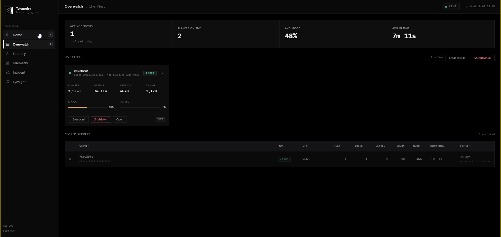

# qtel - roblox telemetry platform for your game 

> qtel is currently in closed alpha testing, for questions related to the project please contact me: adam@pyca.ie

## default roblox pipeline
```
game server -> analytics service -> roblox's analytics platform on create.roblox.com
```

## qtel pipeline
```
game server -> client/server init of qtel controller/service -> telemetry + custom datapoints -> flushed to connect.[your-domain].com -> (external middleware sits here) ->  qtel-dashboard.[your-domain].com 
```

## why qtel? 

qtel allows you to create sophisticated points of collection for game data which can be used to assist roblox developers in trying to solve issues such as user retention, underlying performance/issues, etc. 

we use a batch/flush system so that the external api is not flooded, pending datapoints remain persistent in the serverstorage before being flushed, and are also kept in roblox's datastores in the event of a sudden shutdown/crash, we also have support for server-wide control through the open cloud api  
